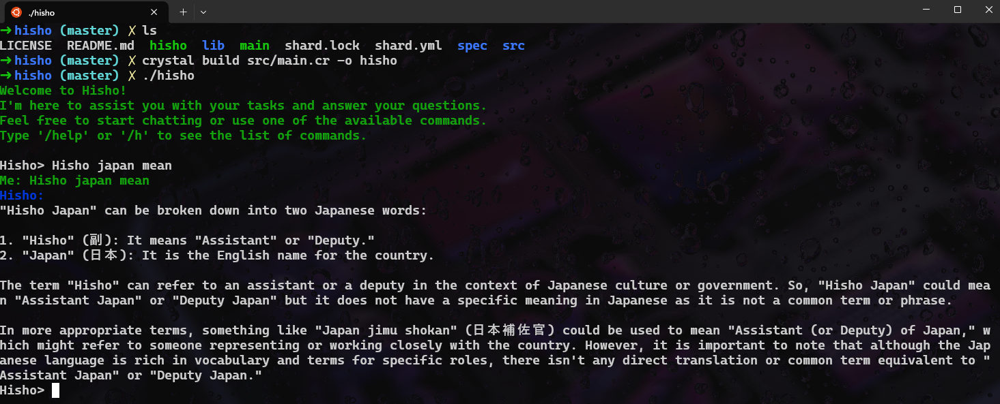

# Hisho

[](https://github.com/denislour/hisho/actions/workflows/crystal.yml)

**Hisho** is a command-line interface (CLI) tool inspired by `Aider`, designed to interact with AI models from `OpenRouter.ai`. Built with Crystal, Hisho aims to provide a seamless and efficient way to communicate with various AI models directly from your terminal.



## Features

- Connect to OpenRouter.ai models with ease
- Simple setup requiring only a model name and OpenRouter.ai API key
- Interactive command-line interface for natural conversations with AI
- Written in Crystal for performance and type safety
- Extensible architecture allowing for easy addition of new features
- **New**: Improved structure for better maintainability

## Installation

### Prerequisites

1. Install Crystal:

   For macOS using Homebrew:

   ```
   brew install crystal
   ```

   For Ubuntu:

   ```
   curl -fsSL https://crystal-lang.org/install.sh | sudo bash
   ```

   For other operating systems, please refer to the [official Crystal installation guide](https://crystal-lang.org/install/).

2. Clone the repository:

   ```
   git clone https://github.com/denislour/hisho.git
   cd hisho
   ```

3. Install dependencies:
   ```
   shards install
   ```

## Configuration

Create a `.env` file in the project root with your `OpenRouter.ai` API key and preferred model:

```
OPENROUTER_API_KEY=<your-openrouter-api-key>
MODEL=<your-preferred-model>
```

## Usage

```
crystal build src/main.cr -o hisho
./hisho
```

## Project Structure

Hisho has been restructured to improve maintainability and extensibility. The new structure makes it easier to add new features and modify existing ones.

## TODO List

We're constantly working to improve Hisho. Here's our current TODO list:

- [ ] Add a File Manager to handle file operations and introduce File classes for storing related data
- [ ] Update Conversation to use an array of File objects instead of strings for added files
- [ ] Expand unit tests in spec for all core functions
- [ ] Add return types to functions where they're missing
- [ ] Organize command files into a dedicated directory
- [ ] Store prompts as constants
- [ ] Prevent CLI termination with Ctrl+C
- [ ] Implement an automatic way to handle /help instead of hardcoding content
- [ ] Implement a robust error handling and reporting mechanism
- [ ] Centralize and manage hardcoded strings

## Contributing

1. Fork it (<https://github.com/denislour/hisho/fork>)
2. Create your feature branch (`git checkout -b my-new-feature`)
3. Commit your changes (`git commit -am 'Add some feature'`)
4. Push to the branch (`git push origin my-new-feature`)
5. Create a new Pull Request

## Contributors

- [Lektor](https://github.com/your-github-user) - creator and maintainer

## Built with Love ❤️

Hisho is built with love and care, aiming to provide a great user experience while maintaining clean and efficient code.
